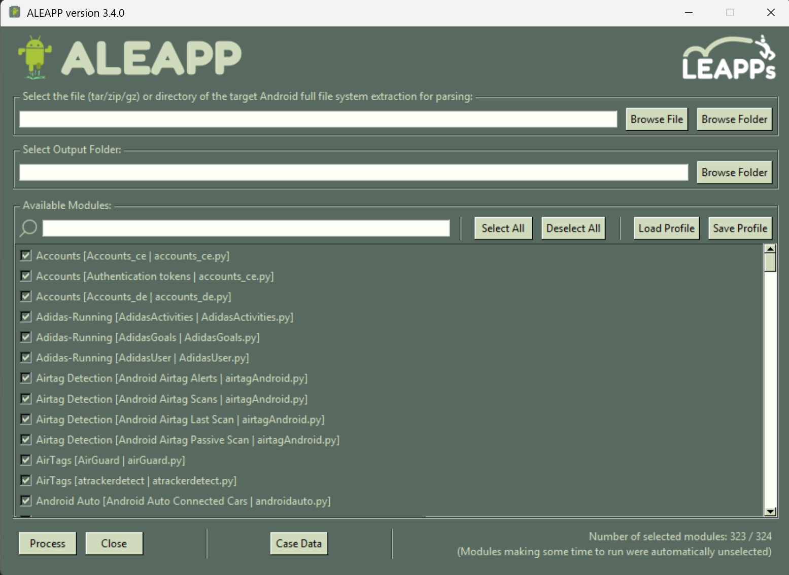
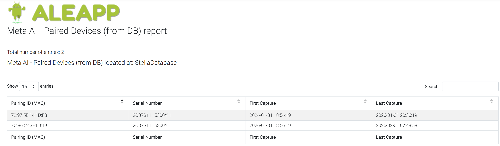
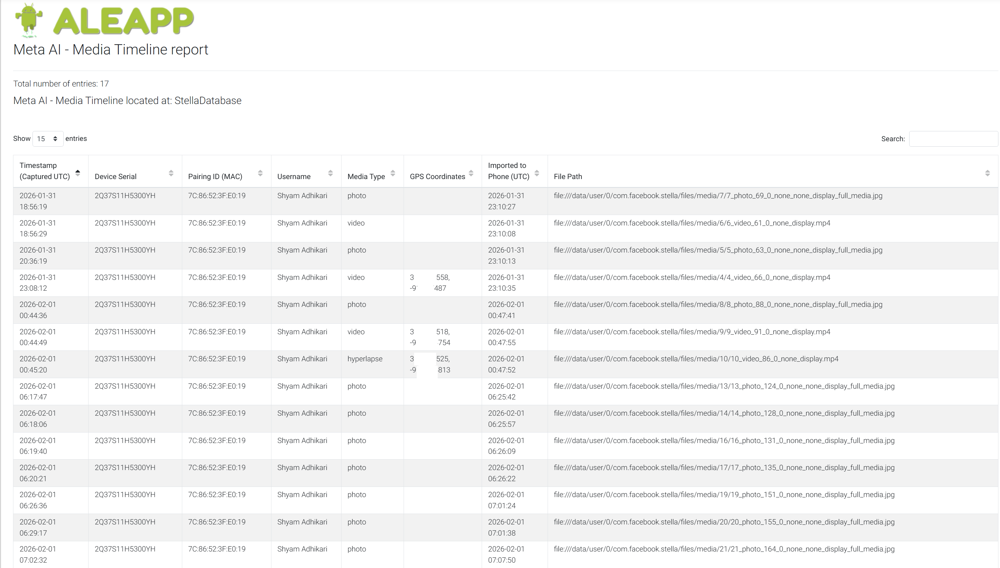
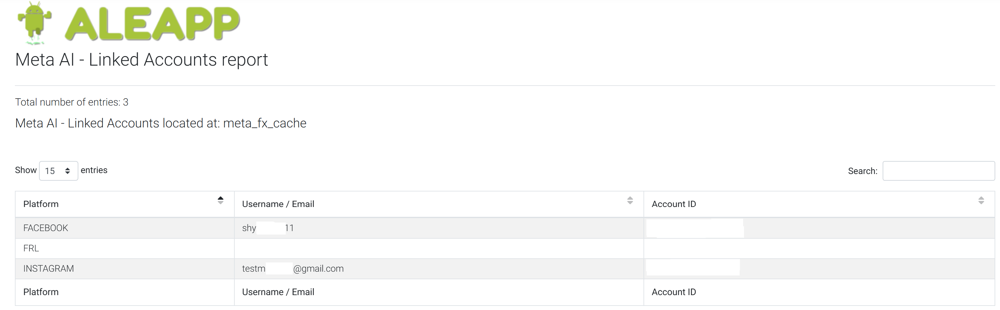
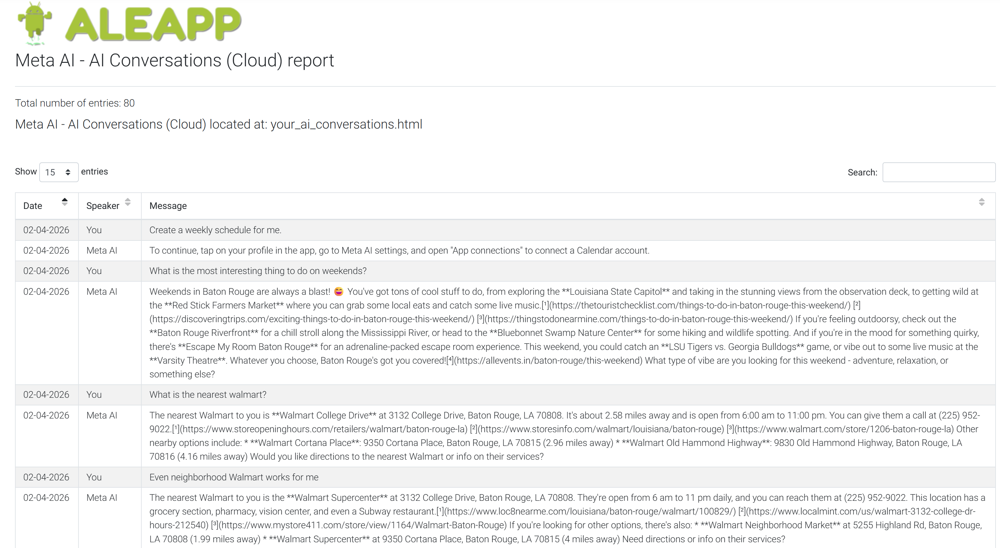
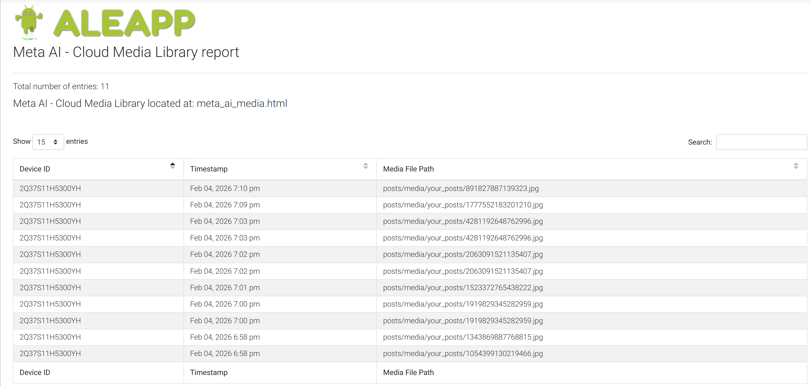

# Example Report Output

This folder contains example screenshots showing how the **Meta AI Parser for ALEAPP** is used and what kinds of reports it generates.

The screenshots are intended to illustrate the workflow and report structure only. They do not include the full source dataset.

---

## Workflow Overview

The parser is designed to run inside **ALEAPP**.

In the example shown here:

1. ALEAPP was opened.
2. A folder containing both the **`com.facebook.stella`** application artifacts and the **cloud export artifacts** was selected using **Browse Folder or File**.
3. In **Available Modules**, **Deselect All** was clicked.
4. The term **Meta AI** was searched.
5. The **Meta AI** parser module was selected.
6. **Process** was clicked to generate the report.

---

## ALEAPP Interface

The screenshot below shows the ALEAPP interface before processing, with the input folder selected and the **Meta AI** parser module chosen.

---

## Example Reports Generated

After processing, ALEAPP generated multiple reports from the Meta AI Android companion app artifacts and cloud export files. Example outputs are shown below.

### 1. Paired Devices (from DB)

This report shows paired device information recovered from the local database, including device pairing identifiers, serial numbers, and capture timestamps.

---

### 2. Media Timeline Report

This report correlates media capture events with device identifiers, media types, timestamps, geolocation entries, and imported file paths.

---

### 3. Linked Accounts Report

This report shows linked account information extracted from application artifacts, including platform names, usernames or email addresses, and account identifiers.

---

### 4. AI Conversations (Cloud)

This report shows conversation history recovered from the Meta cloud export, including date, speaker, and message content.

---

### 5. Cloud Media Library

This report shows media references recovered from cloud export files, including device identifiers, timestamps, and media file paths.

---

## Notes

- These screenshots are examples of report structure and artifact presentation.
- Actual output depends on the available input artifacts.
- The parser supports both **local Android companion app artifacts** and selected **Meta cloud export artifacts**.

---

## Related Files

- Main plugin file: `../meta_ai.py`
- Main repository documentation: `../README.md`
